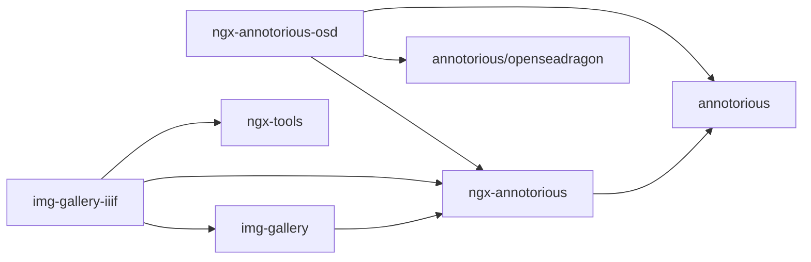

# NgxAnnotorious

This project was generated using [Angular CLI](https://github.com/angular/angular-cli) version 19.0.5.

This workspace contains a self-contained Angular wrapper for Annotorious V3, plus a couple of Cadmus-related libraries depending on it.

To use the Annotorious wrapper you just need Annotorious, and no other dependency. Cadmus libraries are in this workspace for practical reasons, but also provide an example for using the library.

- [Angular Annotorious wrapper](./projects/myrmidon/ngx-annotorious/README.md): 📦 `@myrmidon/ngx-annotorious`.
- [Angular OSD Annotorious wrapper](./projects/myrmidon/ngx-annotorious-osd/README.md): not yet working.
- [Cadmus Image Gallery Brick](./projects/myrmidon/cadmus-img-gallery/README.md): 📦 `@myrmidon/cadmus-img-gallery`.
- [IIIF support for Cadmus Image Gallery Brick](./projects/myrmidon/cadmus-img-gallery-iiif/README.md): 📦 `@myrmidon/cadmus-img-gallery-iiif`.

## Quick Start

1. clone or download this repository.
2. install packages with `npm i`.
3. build libraries with `npm run build-lib`.
4. run with `ng serve`.
5. in the homepage, add annotations and play with them. In this case, the custom model linked to the annotation is just a string, so the popup dialog allows you to enter it. Look at the console for more information from logging. Use the menus to access other functionalities.

## Dependencies

## History

### 0.0.2

- 2024-12-27: first package.
