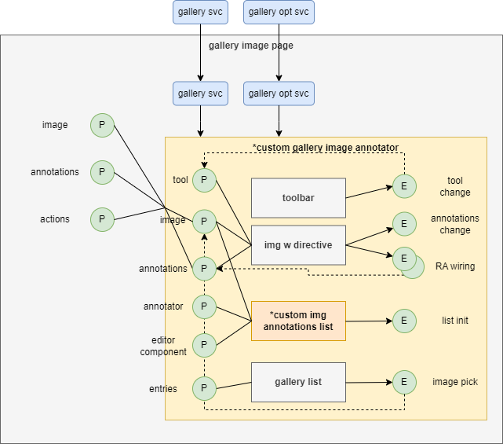

# CadmusImgGallery

This project was generated using [Angular CLI](https://github.com/angular/angular-cli) version 19.0.0.

📦 `@myrmidon/cadmus-img-gallery`

This project was generated using [Angular CLI](https://github.com/angular/angular-cli) version 19.0.0.

- [CadmusImgGallery](#cadmusimggallery)
  - [Overview](#overview)
  - [Annotation IDs](#annotation-ids)
  - [Usage](#usage)
    - [App Configuration](#app-configuration)
    - [Top Level Page](#top-level-page)
    - [Custom Gallery Image Annotator](#custom-gallery-image-annotator)
    - [Custom Image Annotation List](#custom-image-annotation-list)
  - [Services](#services)
  - [Components](#components)
  - [Setup](#setup)

## Overview

The image gallery is a minimalist set of components wrapping [Annotorious](https://annotorious.dev/) functionalities and used to:

- show a _gallery_ of images from some online source.
- let users _pick_ an image and _annotate_ it.

The idea is having a Cadmus part to _create annotations on images_. Once you create these annotations, you will be able to use other parts to _link_ them to any type of specialized data via their ID.

These components are independent from any specific _servicing technology_; images could be served by IIIF, cloud stores, etc.; you are free to provide your own service (implementing [GalleryService](./src/lib/services/mock-gallery.service.ts)) to get a page of images, and a single image, with the desired size. Even the _filters_ used to browse the list of images are totally open, so that you can define as many filters as you want, according to your own data.

## Annotation IDs

As usual in Cadmus, annotation IDs are opaque (and so they are supposed to be), just like items or parts IDs. Yet, at least in the context of the editor, more user-friendly IDs are welcome.

As explained [here](https://myrmex.github.io/overview/cadmus/dev/concepts/lookup), in other Cadmus parts, user friendly IDs are got via EID's (entity IDs); these are:

- aliases of entities which already have their own global ID (a GUID), like items;
- identifiers assigned to entities inside a part.

In both cases, they can be referenced via a lookup UI, where you just type some characters belonging to the ID to get a list of the first matching IDs. To apply the same approach in the context of image annotations, we define a **convention** by which you can _assign an EID to any annotation_ via a tag beginning with `eid_`. For instance, if you draw a rectangle around some region of an image, and assign it the tag `eid_sample`, by convention this means that the annotation linked to that region will get an EID equal to `sample`.

## Usage

Typically you create your own gallery component to orchestrate children components for the gallery list and its annotator. Thus, this is essentially a wrapper for lower level components.

To explain the usage of these components I will refer to the [example](../../../src/app/img/img-gallery-pg/img-gallery-pg.component.ts) page in this app, describing it from top to bottom.



### App Configuration

- 📁 [app.config.ts](../../../src/app/app.config.ts)

(1) ensure to configure `INDEX_LOOKUP_DEFINITIONS` if you are going to use **UI lookup components** targeting annotations IDs, e.g.:

```ts
// in appConfig:

// for lookup in asserted IDs - note that this would require a backend
const INDEX_LOOKUP_DEFINITIONS: IndexLookupDefinitions = {
  item_eid: {
    typeId: 'it.vedph.metadata',
    name: 'eid',
  }
};
```

(2) ensure to configure default **options for Material dialogs**, as annotations metadata are edited inside a popup, e.g.:

```ts
// in appConfig providers array:
{
  provide: MAT_DIALOG_DEFAULT_OPTIONS,
  useValue: {
    hasBackdrop: true,
    maxHeight: '800px',
  },
},
```

(3) configure the **gallery providers**, e.g.:

```ts
// in appConfig providers array:

// if you want to use the mock gallery, uncomment these two providers
// and comment the IIIF ones below.
// mock image gallery
// {
//   provide: IMAGE_GALLERY_SERVICE_KEY,
//   useClass: MockGalleryService,
// },
// {
//   provide: IMAGE_GALLERY_OPTIONS_KEY,
//   useValue: {
//     baseUri: '',
//     count: 50,
//     width: 300,
//     height: 400,
//   },
// },
// IIIF image gallery
{
  provide: IMAGE_GALLERY_SERVICE_KEY,
  useClass: SimpleIiifGalleryService,
},
{
  provide: IMAGE_GALLERY_OPTIONS_KEY,
  useValue: {
    baseUri: '',
    manifestUri:
      'https://dms-data.stanford.edu/data/manifests/Parker/xj710dc7305/manifest.json',
    arrayPath: 'sequences[0]/canvases',
    resourcePath: 'images[0]/resource',
    labelPath: 'label',
    width: 300,
    height: 400,
    targetWidth: 800,
    targetHeight: -1,
    pageSize: 6,
    // skip: 6
  } as SimpleIiifGalleryOptions,
},
```

### Top Level Page

- 📁 [img-gallery-pg.component.ts](../../../src/app/img/img-gallery-pg/img-gallery-pg.component.ts)

In our demo, the page component wrapping a fully functional gallery image annotator is at the top level. Its role is just providing a page wrapping the functionality to be shown in the demo app.

This page component gets injected:

- a _gallery service_ (implementing interface `GalleryService`). This is injected via a token (`IMAGE_GALLERY_SERVICE_KEY`).
- the service for managing the _gallery options_. (`GalleryOptionsService`). The default options are provided by the `IMAGE_GALLERY_OPTIONS_KEY` injection token. You can then update them, get them, or subscribe to them.

The component has these **properties**:

- `image` (`GalleryImage`): the current image being annotated, if any.
- `annotations` (`GalleryImageAnnotation[]`): the annotations on the current image.
- `actions` (`BarCustomAction[]`): the custom actions related to annotations. In this component custom actions are just mock; when invoked, the component will just log the corresponding action object. In a real world application you will take proper action according to it.

The component handles these **events** emitted by its descendants:

- _image pick_: when an image is picked from the gallery, the gallery service is used to retrieve it into `image`.
- _annotations change_: the `annotations` list is updated.
- _action request_: just dump the requested action.

So this is just a wrapper to provide a page binding app-wide services to the gallery. Its template contains a child component representing the gallery image annotator (`app-my-gallery-image-annotator`).

### Custom Gallery Image Annotator

- 📁 [my-gallery-image-annotator.component.ts](../../../src/app/img/my-gallery-image-annotator/my-gallery-image-annotator.component.ts)

This is the annotator wrapped by the top level page component in the demo. It contains a gallery, which allows to pick an image, the image where you can draw shapes for annotations, and the list of annotations.

**Injections**:

- Angular Material dialog service and options.
- gallery service (via `IMAGE_GALLERY_SERVICE_KEY`).
- gallery options service.

**Properties**:

- `image` (`GalleryImage`): the currently edited image, if any.
- `annotations` (`ListAnnotation<MyAnnotationPayload>`): a list of annotations having payload metadata of the specified type (`MyAnnotationPayload`). This is a mock model provided for demo purposes.

**Events**:

- `annotationsChange`: emitted when annotations change.

The component orchestrates these children components:

- image annotator toolbar, which allows users to change the current drawing tool. This emits a tool-change event, which is handled by the container component to set the current tool, bound to the image annotator directive.
- an `img` element (whose source is `image.uri`) decorated with the image annotator directive, which wires all the Annotorious editing events to handlers in the container component.
- a custom image annotations list, bound to the currently edited `image`, the `annotator` instance, and the editor component type (`editorComponent`). This emits a `listInit` event when the list is initialized.

### Custom Image Annotation List

The list of annotations is provided by a custom component. Typically you derive it from `ImgAnnotationListComponent<T>` where `T` is the type of the annotation payload (your own metadata model for the annotation). You should wire to the container component its input properties:

- `annotator`: the instance of the annotator object as received from Annotorious.
- `editorComponent`: the component used to edit a `ListAnnotation`. Pass the component class, e.g. `[editorComponent]="MyEditorComponent"`.
- `image` the image (of type `GalleryImage`) to be annotated.
- optionally, you can set the `annotationToString` property to provide your own function used to build a string from a list annotation object, summarizing its content appropriately.

The base class manages an inner list (of type [ImgAnnotationList](../cadmus-img-annotator/src/lib/components/img-annotation-list/img-annotation-list.ts)), which is lazily instantiated when these properties are set.

Example:

```ts
// my-img-annotation-list.component.ts

@Component({
  standalone: true,
  selector: 'app-my-img-annotation-list',
  templateUrl: './my-img-annotation-list.component.html',
  styleUrls: ['./my-img-annotation-list.component.css'],
  imports: [CommonModule, MatButtonModule, MatIconModule, ObjectToStringPipe],
})
export class MyImgAnnotationListComponent extends ImgAnnotationListComponent<any> {
  public selectAnnotation(annotation: any): void {
    this.list?.selectAnnotation(annotation);
  }

  public removeAnnotation(index: number): void {
    this.list?.removeAnnotation(index);
  }

  public editAnnotation(annotation: any): void {
    this.list?.editAnnotation(annotation);
  }
}
```

Its HTML template should display a list bound to `list.annotations$`, typically with their related actions (select, edit, remove).

## Services

A gallery image is any object implementing the `GalleryImage` interface, which provides the barely minimum properties of each image: a string ID, a URI, a title, and a short description.

Related services are:

- **gallery service**, with its injection token. You will provide your own real-world service, which might draw images from IIIF services, cloud services, etc.
- **gallery options service**, used as the singleton holding options for the gallery. Options are equal to or derive from `GalleryOptions`. You can access the options and change them by injecting this service.
- a **mock gallery service** implementation, using an online mock images service. This is used during development as a convenient placeholder instead of your custom service.
- **lorem ipsum service**, used by the mock gallery service to generate image descriptions.

A gallery service is any service implementing the `GalleryService` interface, having just two methods: one to retrieve a page of images, and another to retrieve a single image.

In both cases, you can specify image options (first of all the size) via options, which implement interface `GalleryOptions`. The service is stateless, except for the fact that it caches the options when first used, and reacts to their change from usage to usage.

Also, the list of images in the gallery can be filtered using an implementation of `GalleryFilter`. This is just a set of key/value pairs, both represented by strings. Usually you will draw a set of keys to show in the filter UI from some thesaurus.

For instance, to filter images by title you will set a filter property with key=`title` and value equal to any portion of the title to match.

## Components

- **gallery filter** (`cadmus-gallery-filter`), to define any number of name=value pairs representing filters applied to the gallery images. The filter gets the gallery list repository injected, so it directly invokes its methods.
  - ➡️ `entries: ThesaurusEntry[] | undefined`: the entries used to represent image gallery metadata filters. Each entry is a metadatum, with ID=metadatum name and value=label. If not set, users will be allowed to freely type a name rather than picking it from a list.

- **gallery images list** (`cadmus-gallery-list`), to browse a list of images via a gallery service implementation. The type of implementation used is defined by your consumer application (via DI as specified in `app.module` or `appConfig` providers). Both the list and its filter depend on the same instance of a **gallery list repository** (`GalleryListRepository`), which provides paged data to the UI.
  - ➡️ `entries: ThesaurusEntry[] | undefined`: the entries used to represent image gallery metadata filters. Each entry is a metadatum, with ID=metadatum name and value=label. If not set, users will be allowed to freely type a name rather than picking it from a list.
  - ⬅️ `imagePick: EventEmitter<GalleryImage>`

- [gallery image annotator](../cadmus-img-annotator/README.md), to annotate an image picked from a gallery by drawing rectangular or polygonal regions on it.

## Setup

To use this brick in your Cadmus frontend app:

(1) install packages:

```bash
npm i @recogito/annotorious @myrmidon/cadmus-img-annotator @myrmidon/cadmus-img-gallery
```

(2) ensure to add Annotorious CSS styles to your `angular.json` like:

```json
"styles": [
  "node_modules/@angular/material/prebuilt-themes/indigo-pink.css",
  "node_modules/@recogito/annotorious/dist/annotorious.min.css",
  "src/styles.css"
]
```

(3) import modules in your `app.module.ts` (or `app-config.ts`) and inject the required image service and default options (you can then change them later via `GalleryOptionsService`):

```ts
// app.module.ts

import { CadmusImgAnnotatorModule } from '@myrmidon/cadmus-img-annotator';
import { CadmusImgGalleryModule } from '@myrmidon/cadmus-img-gallery';

@NgModule({
  // ...
  imports: [
    // ...
    CadmusImgAnnotatorModule,
    CadmusImgGalleryModule,
  ],
  providers: [
    // image gallery: TODO replace with your own
    {
      provide: IMAGE_GALLERY_SERVICE_KEY,
      useClass: MockGalleryService,
    },
    {
      provide: IMAGE_GALLERY_OPTIONS_KEY,
      useValue: {
        baseUri: '',
        count: 50,
        width: 300,
        height: 400,
      },
    },
  ]
  // ...
})
export class AppModule {}
```

(4) if you want to lookup annotations by their EID, be sure to include the corresponding lookup definition like:

```ts
import { IndexLookupDefinitions } from '@myrmidon/cadmus-core';
import {
  GALLERY_IMAGE_ANNOTATIONS_PART_TYPEID,
} from '@myrmidon/cadmus-part-general-ui';

export const INDEX_LOOKUP_DEFINITIONS: IndexLookupDefinitions = {
  // ...
  // gallery
  img_anno_eid: {
    typeId: GALLERY_IMAGE_ANNOTATIONS_PART_TYPEID,
    name: 'eid',
  },
};
```
